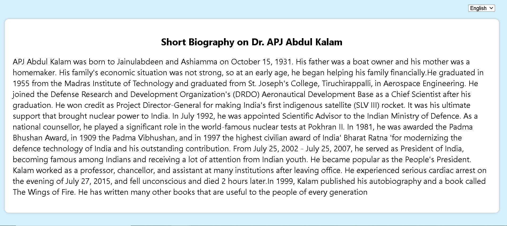

# Internationalization (I18n)

### Internationalization (I18n) in a React project is all about ensuring that your app or website is user-friendly and easily understandable for people, regardless of the language they speak. In this project, you'll learn how to apply the I18n concept and implement it effectively, making your app universally comprehensible.

